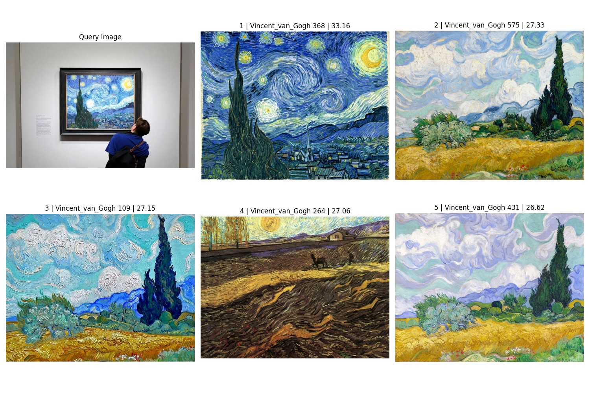

# Pocket Docent

## 개요

Pocket Docent는 고급 비전 모델을 활용한 미술품 이미지 검색 시스템입니다. 본 시스템은 사용자가 제공한 이미지를 기반으로 코사인 유사도 인덱싱(cosine similarity indexing)을 통해 유사한 미술 작품을 효율적이고 정확하게 식별하여 제공합니다.

## 개발 환경

### 필수 요구사항

본 프로젝트는 Rye 패키지 관리자를 사용합니다. 아래 명령어를 통해 설치할 수 있습니다.

```bash
curl -sSf https://rye.astral.sh/get | bash
```

자세한 설치 방법은 [Rye 공식 설치 가이드](https://rye.astral.sh/guide/installation/)를 참조하시기 바랍니다.

### 의존성 설치

지정된 Python 버전 및 필요한 의존성 패키지를 설치합니다.

```bash
rye sync
```

## 사용 모델

### DINOv2 모델

[DINOv2](https://github.com/facebookresearch/dinov2)는 Vision Transformer(ViT) 아키텍처를 기반으로 하며, 자기지도학습(self-supervised learning) 방식으로 대규모 이미지 데이터셋에서 사전 학습된 트랜스포머 인코더 모델입니다. 본 프로젝트에서는 ONNX 형식으로 변환된 모델 파일을 사용합니다.

- [small](https://huggingface.co/onnx-community/dinov2-small): 88.5 MB (384 차원)
- [base](https://huggingface.co/onnx-community/dinov2-base): 346.6 MB (768 차원)
- [large](https://huggingface.co/onnx-community/dinov2-large): 1.22 GB (1024 차원)

다음 명령어를 통해 모델 파일을 다운로드할 수 있습니다:

```bash
curl -L https://huggingface.co/onnx-community/dinov2-small/resolve/main/onnx/model.onnx -o models/dinov2_vits14.onnx
curl -L https://huggingface.co/onnx-community/dinov2-base/resolve/main/onnx/model.onnx -o models/dinov2_vitb14.onnx
curl -L https://huggingface.co/onnx-community/dinov2-large/resolve/main/onnx/model.onnx -o models/dinov2_vitl14.onnx
```

### Grounding DINO 모델

Grounding DINO는 개방형 객체 감지(open-set object detection)를 위해 텍스트 인코더로 확장된 객체 감지 모델입니다. 본 프로젝트에서는 PyTorch 모델을 사용합니다.

- [tiny](https://huggingface.co/IDEA-Research/grounding-dino-tiny): 692 MB

## 데이터셋

### 테스트 데이터

초기 테스트를 위한 데이터는 다음과 같은 유명 미술 작품 이미지를 구글 검색을 통해 수집하였습니다:

- [생각하는 사람](https://ko.wikipedia.org/wiki/생각하는_사람)
- [모나리자](https://ko.wikipedia.org/wiki/모나리자)
- [반가사유상](https://ko.wikipedia.org/wiki/반가사유상)
- [피카소 작품](https://ko.wikipedia.org/wiki/파블로_피카소)
- [별이 빛나는 밤](https://ko.wikipedia.org/wiki/별이_빛나는_밤)

### 주요 데이터셋: Best Artworks of All Time

[Kaggle Dataset - Best Artworks of All Time](https://www.kaggle.com/datasets/ikarus777/best-artworks-of-all-time/)은 영향력 있는 예술가 50명의 작품을 수집한 데이터셋입니다. 이 데이터셋은 작품 이미지가 예술가별로 숫자로 구분되어 제공됩니다. 예술가에 대한 메타데이터는 포함되어 있으나, 개별 작품에 대한 메타데이터는 제공되지 않습니다.

데이터셋 다운로드 및 설치:

```bash
curl -L https://www.kaggle.com/api/v1/datasets/download/ikarus777/best-artworks-of-all-time -o assets/best-artworks-of-all-time.zip && \
unzip assets/best-artworks-of-all-time.zip -d assets/best_artworks_of_all_time
```

## 사용 방법

### 데모 실행

다음 명령어를 통해 데모를 실행할 수 있습니다:

```bash
rye run demo --model small --image-dir assets/sample_images
```

### 이미지 인덱싱

[FAISS 라이브러리의 코사인 유사도](https://github.com/facebookresearch/faiss/wiki/Faiss-indexes) 기능을 활용하여 미술품 이미지를 인덱싱합니다:

```bash
rye run register --model base
```

인덱싱 결과 파일:

- `artworks_metadata.npy`: 14.5 MB
- `dinov2_vits14_index.faiss`: 12.5 MB
- `dinov2_vitb14_index.faiss`: 24.9 MB
- `dinov2_vitl14_index.faiss`: 33.3 MB

### 이미지 검색

코사인 유사도로 구성된 인덱스를 기반으로 유사한 미술품을 검색합니다:

```bash
rye run search --detector grounding_dino_tiny --model small --query-image assets/sample_images/mo_0.jpeg
```

## 실험 결과

미술품 외의 영역이 이미지에 포함될 경우 검색 성능이 저하됩니다. 그러나 조명 변화 등으로 인한 색조 차이에도 불구하고 비교적 안정적인 검색 결과를 제공합니다. 또한, 모델 크기가 증가할수록 검색 정확도가 향상됩니다.

### DINOv2 모델 성능 비교

| 샘플 이미지 | DINOv2 small | DINOv2 base | DINOv2 large |
|:------:|:------------:|:-----------:|:------------:|
| [mo_0.jpeg](./assets/sample_images/mo_0.jpeg) |  |  |  |
| [mo_2.jpeg](./assets/sample_images/mo_2.jpeg) |  |  |  |
| [pi_1.jpeg](./assets/sample_images/pi_1.jpeg) |  |  |  |

### Grounding DINO + DINOv2 결합 성능

Grounding DINO 모델을 preprocessing 처럼 활용하여 미술품 영역만 detecting 한 후에 미술품을 검색할 경우, 단일 DINOv2 모델 대비 현저히 향상된 검색 정확도를 보여줍니다.

| 샘플 이미지 | GroundingDINO + DINOv2 small |
|:------:|:----------------------------:|
| [mo_0.jpeg](./assets/sample_images/mo_0.jpeg) |  |
| [mo_1.jpeg](./assets/sample_images/mo_1.jpeg) |  |
| [mo_2.jpeg](./assets/sample_images/mo_2.jpeg) |  |
| [mo_3.jpeg](./assets/sample_images/mo_3.jpeg) |  |
| [mo_4.jpeg](./assets/sample_images/mo_4.jpeg) |  |
| [go_0.jpeg](./assets/sample_images/go_0.jpeg) |  |

## Citations

```bibtex
@misc{oquab2023dinov2,
      title={DINOv2: Learning Robust Visual Features without Supervision},
      author={Maxime Oquab and Timothée Darcet and Théo Moutakanni and Huy Vo and Marc Szafraniec and Vasil Khalidov and Pierre Fernandez and Daniel Haziza and Francisco Massa and Alaaeldin El-Nouby and Mahmoud Assran and Nicolas Ballas and Wojciech Galuba and Russell Howes and Po-Yao Huang and Shang-Wen Li and Ishan Misra and Michael Rabbat and Vasu Sharma and Gabriel Synnaeve and Hu Xu and Hervé Jegou and Julien Mairal and Patrick Labatut and Armand Joulin and Piotr Bojanowski},
      year={2023},
      eprint={2304.07193},
      archivePrefix={arXiv},
      primaryClass={cs.CV}
}
```

```bibtex
@article{liu2023grounding,
  title={Grounding dino: Marrying dino with grounded pre-training for open-set object detection},
  author={Liu, Shilong and Zeng, Zhaoyang and Ren, Tianhe and Li, Feng and Zhang, Hao and Yang, Jie and Li, Chunyuan and Yang, Jianwei and Su, Hang and Zhu, Jun and others},
  journal={arXiv preprint arXiv:2303.05499},
  year={2023}
}
```

## Licenses

- [facebookresearch/dinov2](https://github.com/facebookresearch/dinov2/blob/main/LICENSE): Apache License 2.0
- [IDEA-Research/GroundingDINO](https://github.com/IDEA-Research/GroundingDINO/blob/main/LICENSE): Apache License 2.0
- [ikarus777/best-artworks-of-all-time](https://creativecommons.org/licenses/by-nc-sa/4.0/): CC BY-NC-SA 4.0
