# Pocket Docent

이미지로 미술품을 검색

## Environment

[Rye 설치 가이드](https://rye.astral.sh/guide/installation/) 참고

```bash
curl -sSf https://rye.astral.sh/get | bash
```

설정된 Python version 및 필요한 dependencies 설치

```bash
rye sync
```

## Models

### DINOv2

[DINOv2](https://github.com/facebookresearch/dinov2) 모델은 Vision Transformer(ViT)로써 self-supervised 방식으로 방대한 이미지 컬렉션에서 사전 학습된 transformer encoder model 입니다. 여기서는 onnx 형태로 변환한 모델 파일을 사용합니다.

- [small](https://huggingface.co/onnx-community/dinov2-small): 88.5 MB, (384 dimension)
- [base](https://huggingface.co/onnx-community/dinov2-base): 346.6 MB (768 dimension)
- [large](https://huggingface.co/onnx-community/dinov2-large): 1.22 GB (1024 dimension)

```bash
curl -L https://huggingface.co/onnx-community/dinov2-small/resolve/main/onnx/model.onnx -o models/dinov2_vits14.onnx
curl -L https://huggingface.co/onnx-community/dinov2-base/resolve/main/onnx/model.onnx -o models/dinov2_vitb14.onnx
curl -L https://huggingface.co/onnx-community/dinov2-large/resolve/main/onnx/model.onnx -o models/dinov2_vitl14.onnx
```

### Grounding DINO

Grounding DINO 모델은 개방형 object detection을 위해 text encoder로 확장된 객체 감지 모델입니다. 여기서는 PyTorch 모델을 사용합니다.

- [tiny](https://huggingface.co/IDEA-Research/grounding-dino-tiny): 692 MB

## Data

### Sample data

초기 테스트 데이터는 구글 검색을 통해 [생각하는 사람](https://ko.wikipedia.org/wiki/생각하는_사람), [모나리자](https://ko.wikipedia.org/wiki/모나리자), [반가사유상](https://ko.wikipedia.org/wiki/반가사유상), [피카소](https://ko.wikipedia.org/wiki/파블로_피카소) 이미지를 다운받았습니다.

### Best Artworks of All Time

[Kaggle Dataset - Best Artworks of All Time](https://www.kaggle.com/datasets/ikarus777/best-artworks-of-all-time/) 영향력있는 예술가 50명의 작품을 모았으며, 작품 이미지가 예술가별 숫자로 구분하여 제공되고 있습니다. 예술가에 대한 메타 정보가 있으나 각 작품에 대한 메타 정보는 없습니다.

```bash
curl -L https://www.kaggle.com/api/v1/datasets/download/ikarus777/best-artworks-of-all-time -o assets/best-artworks-of-all-time.zip && \
unzip assets/best-artworks-of-all-time.zip -d assets/best_artworks_of_all_time
```

## How to use

### Demo

```bash
# example
rye run demo --model small --image-dir assets/sample_images
```

### 등록

[FAISS 의 cosine similarity](https://github.com/facebookresearch/faiss/wiki/Faiss-indexes)를 사용하여 인덱싱

```bash
# example
rye run register --model base
```

- `artworks_metadata.npy`: 14.5 MB
- `dinov2_vits14_index.faiss`: 12.5 MB
- `dinov2_vitb14_index.faiss`: 24.9 MB
- `dinov2_vitl14_index.faiss`: 33.3 MB

### 검색

인덱싱 등록이 cosine similarity 로 되어 있으므로 인덱싱에 맞게 검색

```bash
# example
rye run search --detector grounding_dino_tiny --model small --query-image assets/sample_images/mo_0.jpeg
```

## Result

미술품이 정확환 크기로 잘려져 있지 않는한 이미지 검색을 하는데 성능이 많이 떨어집니다. 조명 등의 이슈로 톤이 달라져도 비교적 잘 검색합니다. 모델의 크기가 커질 수록 더 좋은 결과를 보여줍니다.

| Sample | DINOv2 small | DINOv2 base | DINOv2 large |
|:------:|:------------:|:-----------:|:------------:|
| [mo_0.jpeg](./assets/sample_images/mo_0.jpeg) | 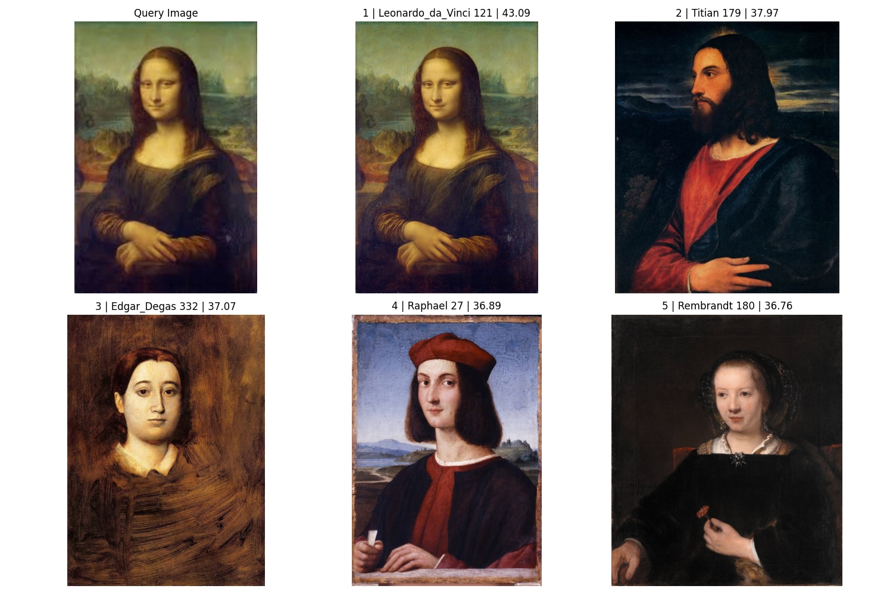 | 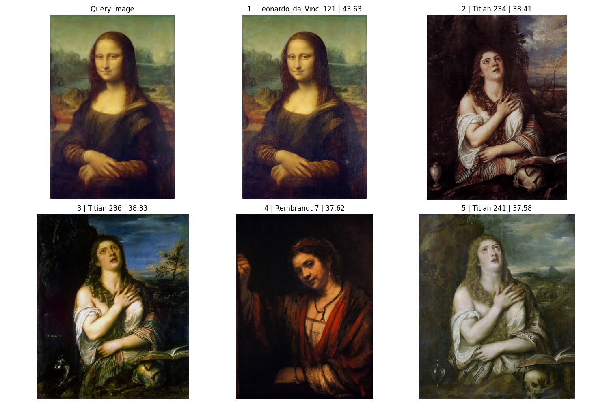 | 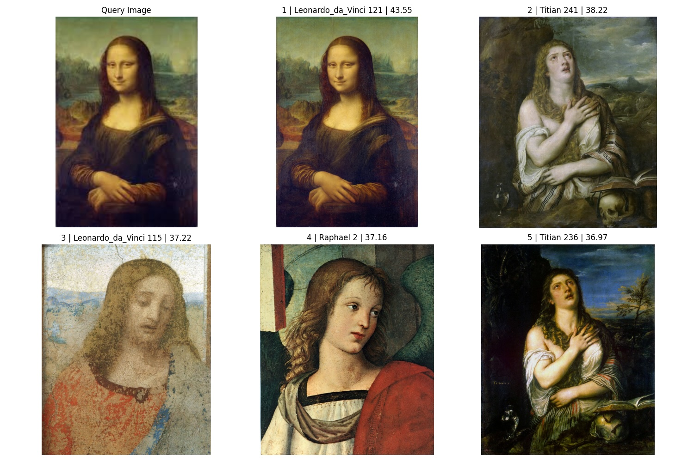 |
| [mo_2.jpeg](./assets/sample_images/mo_2.jpeg) | 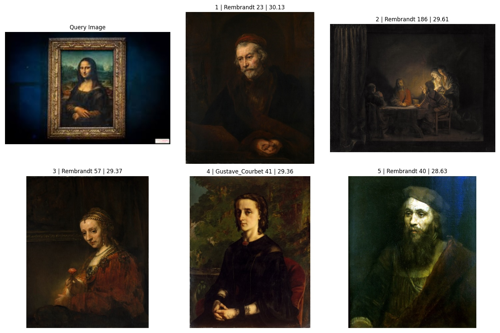 | 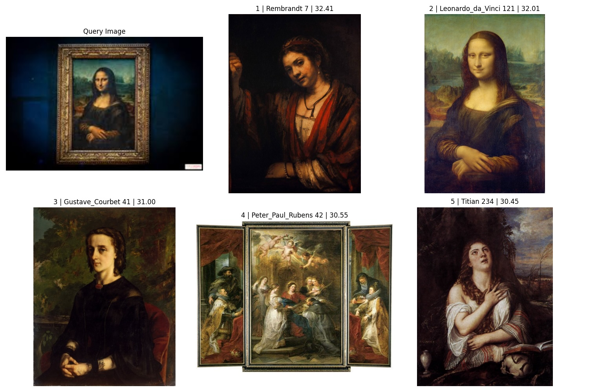 | 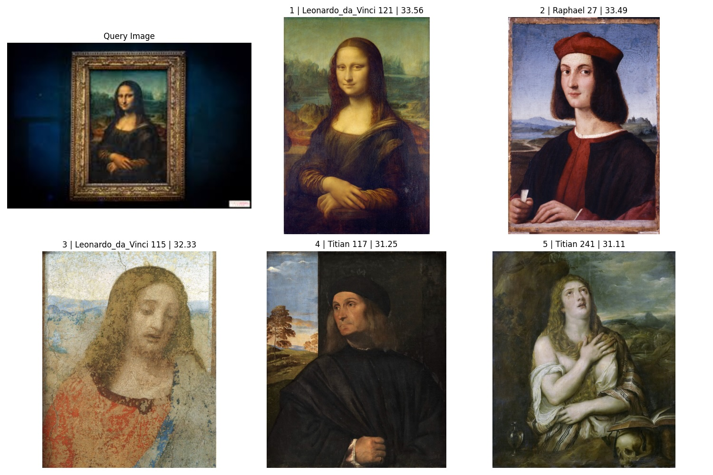 |
| [pi_1.jpeg](./assets/sample_images/pi_1.jpeg) | 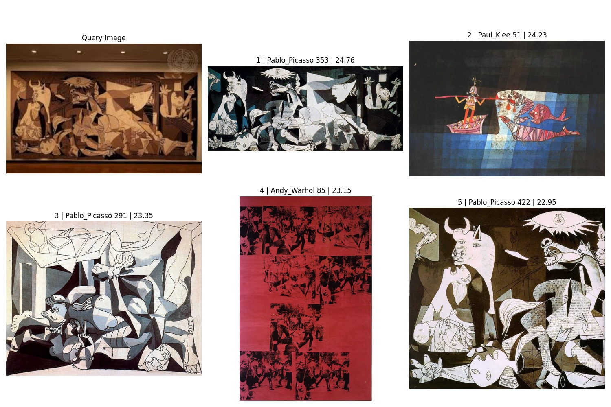 | 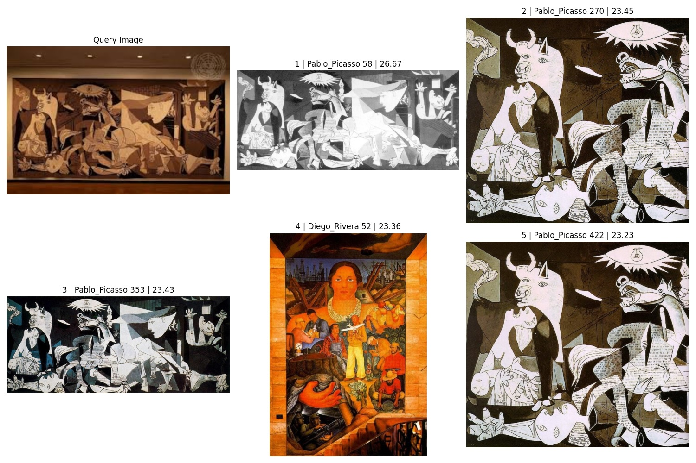 | 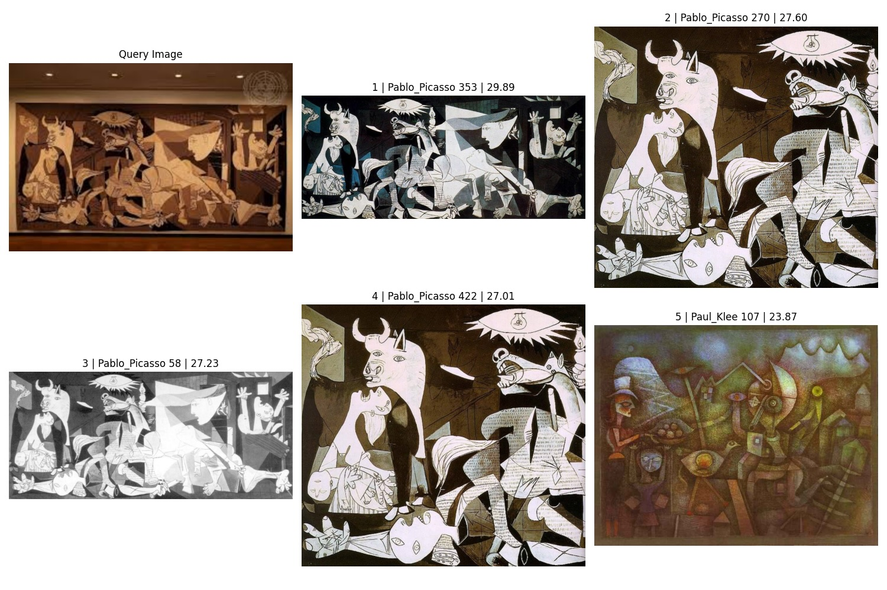 |

Grounding DINO 로 artwork 을 검색하면, 이전보다 훨씬 정확한 결과를 보여줍니다.

| Sample | GroundingDINO + DINOv2 small |
|:------:|:----------------------------:|
| [mo_0.jpeg](./assets/sample_images/mo_0.jpeg) | 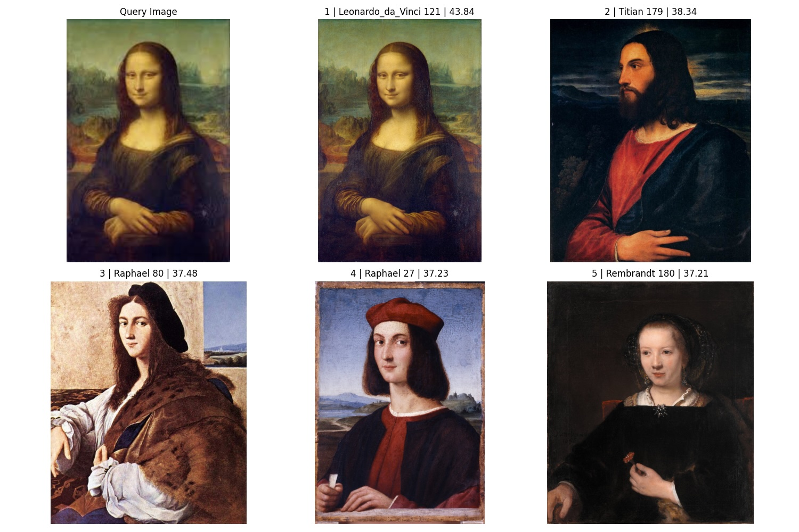 |
| [mo_1.jpeg](./assets/sample_images/mo_1.jpeg) | 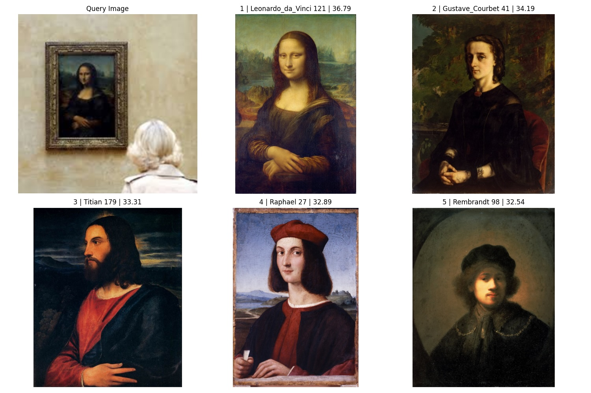 |
| [mo_2.jpeg](./assets/sample_images/mo_2.jpeg) | 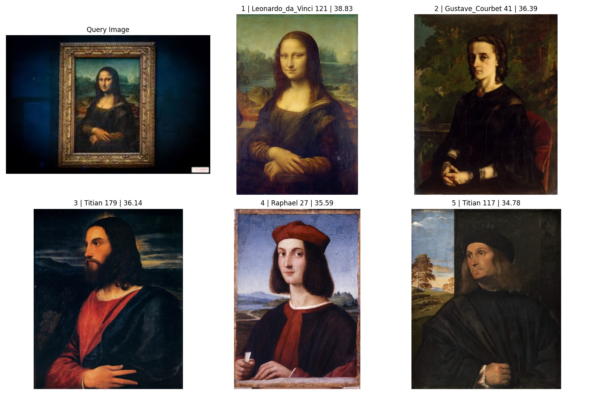 |
| [mo_3.jpeg](./assets/sample_images/mo_3.jpeg) | 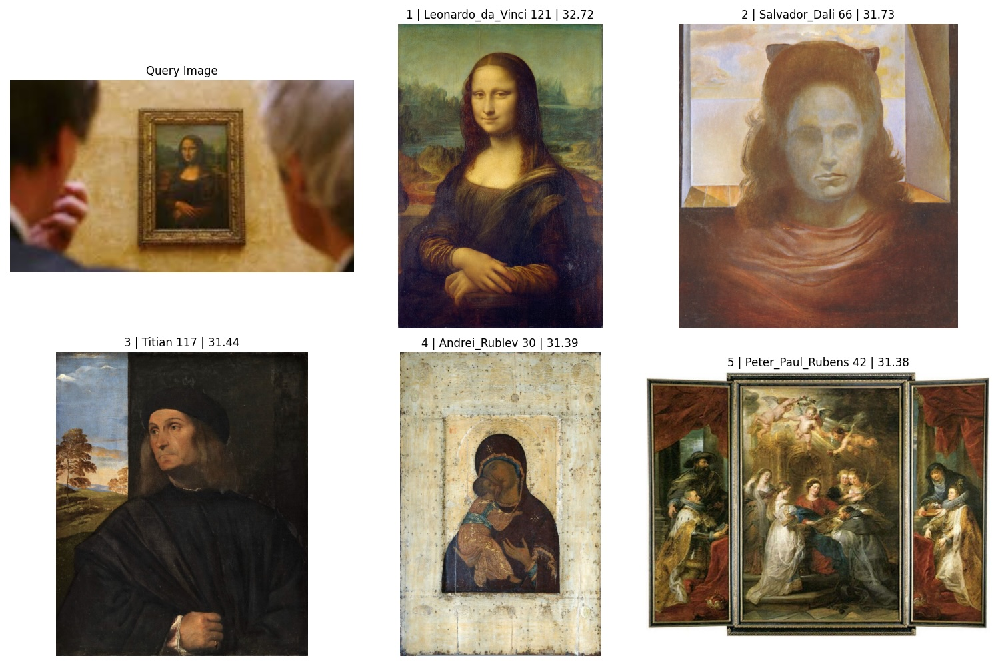 |
| [mo_4.jpeg](./assets/sample_images/mo_4.jpeg) | 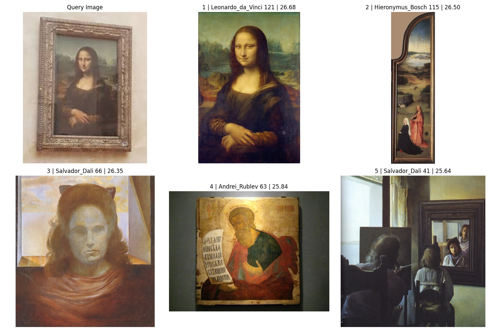 |

## Citations

```bibtex
@misc{oquab2023dinov2,
      title={DINOv2: Learning Robust Visual Features without Supervision},
      author={Maxime Oquab and Timothée Darcet and Théo Moutakanni and Huy Vo and Marc Szafraniec and Vasil Khalidov and Pierre Fernandez and Daniel Haziza and Francisco Massa and Alaaeldin El-Nouby and Mahmoud Assran and Nicolas Ballas and Wojciech Galuba and Russell Howes and Po-Yao Huang and Shang-Wen Li and Ishan Misra and Michael Rabbat and Vasu Sharma and Gabriel Synnaeve and Hu Xu and Hervé Jegou and Julien Mairal and Patrick Labatut and Armand Joulin and Piotr Bojanowski},
      year={2023},
      eprint={2304.07193},
      archivePrefix={arXiv},
      primaryClass={cs.CV}
}
```

## Licenses

- [facebookresearch/dinov2](https://github.com/facebookresearch/dinov2/blob/main/LICENSE) is licensed under the Apache License 2.0
- [IDEA-Research/GroundingDINO](https://github.com/IDEA-Research/GroundingDINO/blob/main/LICENSE) is licensed under the Apache License 2.0
- [ikarus777/best-artworks-of-all-time](https://creativecommons.org/licenses/by-nc-sa/4.0/) is licensed under the CC BY-NC-SA 4.0
